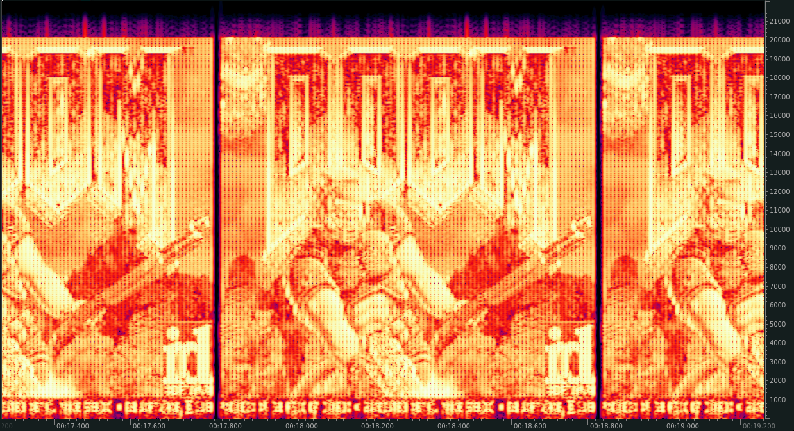

# DOOM-audio

**DOOM playable over an audio connection!**

DOOM-audio outputs its video for viewing as a spectrogram, and takes audio input.



Source-port of [doomgeneric](https://github.com/ozkl/doomgeneric).

You will need a WAD file (game data). If you don't own the game, the shareware version is freely available.

## Requirements

You will need PortAudio development libraries, named `portaudio19-dev` in Debian repositories.

## Building

Creates ```doom_audio/doom_audio```
```
cd src
make
```

## Playing

### Display

You will need software capable of generating a live spectrogram to view the game's output. The best software for this is [ocenaudio](https://www.ocenaudio.com/en/) with the following configuration:

```
Recording:
- Sample Rate: 44100 Hz
- Channels: Mono
- Resolution: 32 bits
Sound preferences:
- Buffer Size: 64 samples
Spectrogram preferences:
- Number of Bins: 512
- Window Size: 100%
- Dyanmic Range: 130dB
- Normalize
```

### Input

For your convenience, a python script `src/controller.py` exists that emits sine waves with the appropriate frequencies based on the keys being pressed. You will need to provide this script's audio output to your default audio input. The controls are based on the "Default controls" found [here](https://doom.fandom.com/wiki/Controls).

## Credits

A huge thank you goes out to:

- Takuya OOURA for creating the [General Purpose FFT Package](https://www.kurims.kyoto-u.ac.jp/~ooura/fft.html)
- [ozkl](https://github.com/ozkl) for creating [doomgeneric](https://github.com/ozkl/doomgeneric).
